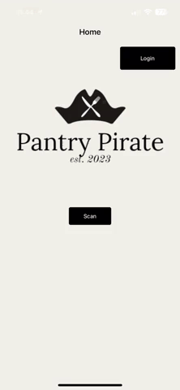
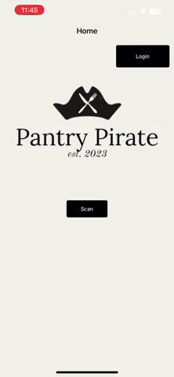
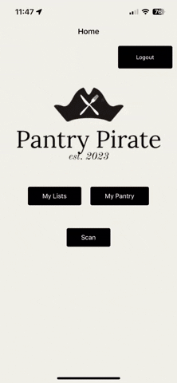
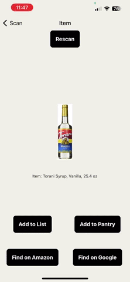
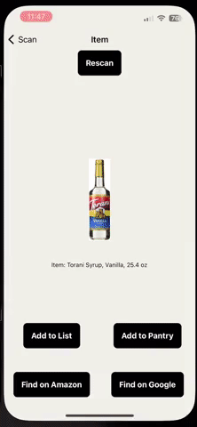
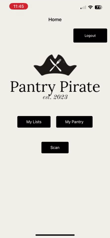
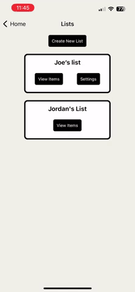
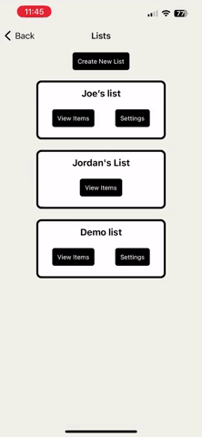
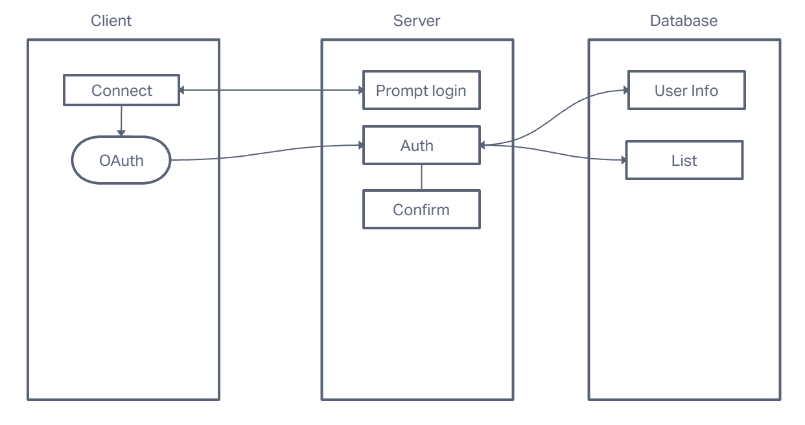
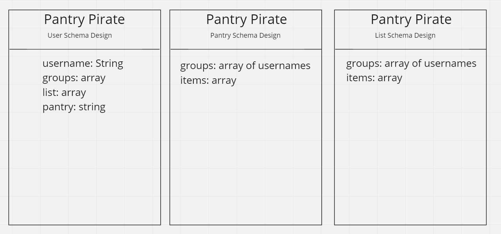

# Pantry Pirate

* [STARTUP](#startup)
* [DEMO](#demo)
  * [Application](#application)
* [Tools Used](#tools-used)
* [Documentation](#documentation)
  * [Team Members](#team-members)
    * [UML](#uml)
    * [Wireframe](#wireframe)
    * [Schema](#schema)

<small><i><a href='http://ecotrust-canada.github.io/markdown-toc/'>Table of contents generated with markdown-toc</a></i></small>

This is a [group project](https://github.com/PriceFinder/PantryPirate-FE) I participated in at Code Fellows. It is an Expo/React Native app that utilizes smartphone hardware to scan barcodes and retrieve product information from the Amazon API.

## STARTUP

1. Clone the repo
2. `npm install`
3. `npx expo start -tunnel`
4. Scan QR code with your phone utilizing Expo Go

## DEMO

### Application

Utilizing the Amazon API, we created a mobile application that allows users to scan barcodes and retrieve the item's data to then store either in a shopping list or in their personal pantry. Need to have a shared shopping list or pantry? Our app allows users to add members to either, making it possible to know both what is currently in the pantry at home while out shopping and also the list of items still needed.

> Implemented password verification at sign-up.

> Users can login to access stored data.

> Users can scan barcodes to retrieve product information from Amazon API.

> Users can view product on Amazon or Google Shopping.

> User can add scanned item to list or pantry.

> Users can view their shopping list and cross off or delete items.

> Users can view and edit shared lists as well.

> Users can create new lists and add members.

> Users can edit list name and add/remove members as well as delete the list as long as they are the creator of the list.

> Pantry acts as an inventory system that allows user to add items to a shopping list or delete items from the pantry.

## Tools Used

* [React Native](https://reactnative.dev/)
* [Expo](https://expo.io/)
* [MongoDB](https://www.mongodb.com/)
* [Node](https://nodejs.org/en/)
* [Axios](https://www.npmjs.com/package/axios)
* [Expo Barcode Scanner](https://docs.expo.io/versions/latest/sdk/bar-code-scanner/)
* [Amazon API](https://rapidapi.com/logicbuilder/api/amazon-product-reviews-keywords/)

## Documentation

### Team Members

Adrienne Frey, Joe Davitt, Jordan Covington, Jeremy Cleland, Steve Gant

#### UML

#### Wireframe

#### Schema

